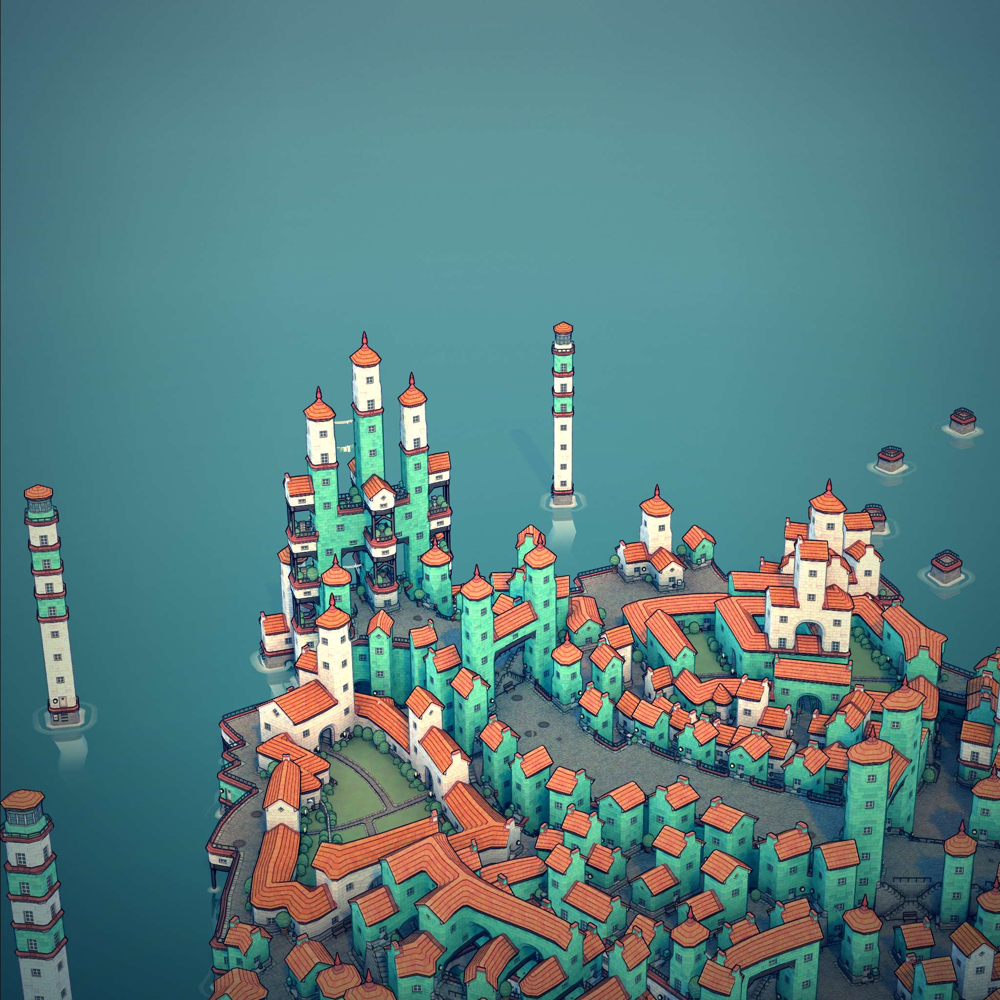
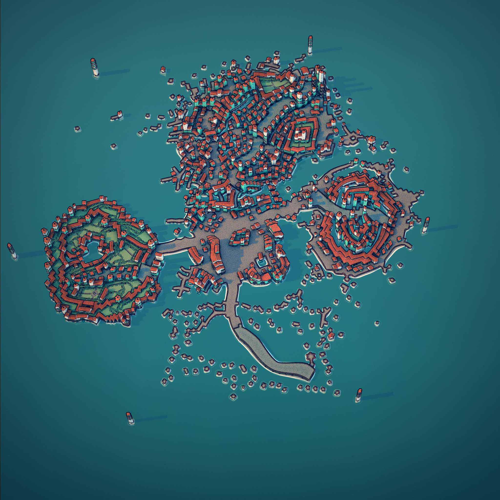

# Teātoa

A fictional Pacific Island created in Townscaper

## Map

First I took a top down screenshot of the island, using the plain colors view:

Then, using colors I cribbed from a Google Maps screenshot, I used the magic 
wand tool in Photoshop to select and fill regions with the new map colors

I then used the polygon lasso tool to draw roads, and added some labels and 
icons

[Photoshop file with layers etc](files/te%C4%81toa-map.psd)

## Construction and Gallery

